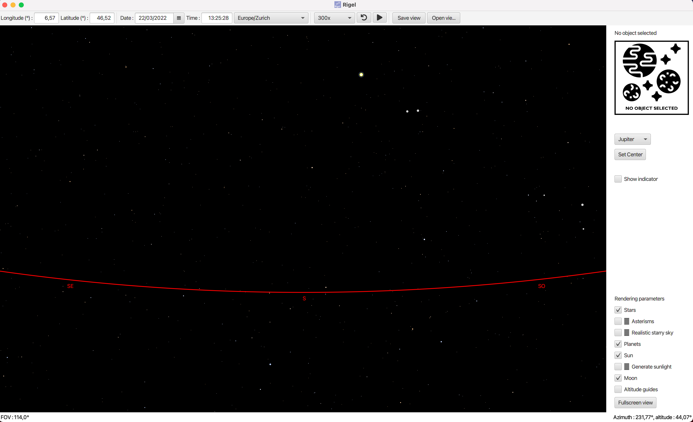

# Rigel

During our first year at EPFL in Communciation Systems, with [Malo Ranzetti](https://github.com/mrztti) 
we were assigned an
object-oriented programming project. The details of this project 
can be found [here](https://cs108.epfl.ch/archive/20/archive.html).

The task was to program in Java a graphical user interface
enabling the visualization of the night sky. 

The features include zooming in or out of the sky, simulating the passing time,
clicking on stars or planets for specific information about the celestial object
and many more.

## How to run with IntelliJ

- First clone the repository
- Download the [JavaFX SDK](https://gluonhq.com/products/javafx/) and unzip the file
- Open the project with IntelliJ
- Make sure your project is running with Java SDK version 11.0.2
- Under *File -> Project Structure -> Plateform Setting -> Global Libraries*
add a Java library and select all files within the **lib** folder of the downloaded JavaFX SDK
- Run with the configurations under **/.idea/runConfigurations/Main.xml**

